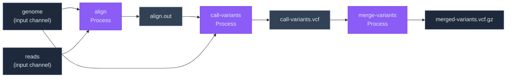

# Workflow


## Core Concepts
 -  Workflow: is a group of processes, channels and artifacts, used to describe the steps, how data flows and how
    to execute them, forming an execution graph.
  - Process: A unit of work that executes a command in an image that will be run in a supported runtime.
    They receive input from a channel and can have the file paths interpolated into the command; have their resource
    requirements specified;
  - Channel: An append-only stream of Artifacts; channels connect processes through their input and output. The process
    becomes runnable when its input channel receives an artifact, instead of waiting for a trigger or for all output
    artifacts to be available. Artifacts are never consumed or removed, each subscriber maintains a cursor to its current.
    processing artifact, so a channel can be connected to multiple processes, and an output of a process becomes a channel,
    automatically, so it can be connected to multiple processes as their input.
    Channels are typed, indicating what types of artifacts they can receive and how they emit.
   - Types:
     - Path: A path or glob pattern to a file or directory in the storage, emitting one item per matching file.
     - Result: An output channel produced by a process emits items as the process writes to them.
     - Literal: A single, statically known value; emits a single item.
     - Zip: Synchronizes multiple channels into a single one, emitting an item when all the channels have an item at the current cursor.
 - Artifact: An URI pointing to a file or directory in an accessible storage, it becomes content-address for cache correctness, 
   and fingerprinting, so that the process can be skipped if the content hasn't changed.
 - Runtime: An isolated environment that can run processes and has access to the storage, currently only Docker is supported, with
   plans for Firecracker in the future.


 

### The Workflow file

The workflow is defined using [KDL](https://kdl.dev/) language, which is a domain-specific language for describing
configuration files. It allows defining a workflow in a human-readable format, while being forgiving with its format
and easily extendable to support new features.

Every file starts with the `workflow` block, which contains the name as well as the list of processes and channels.

#### Complete Example

```kdl
workflow "mega-alignment" {
    
    process "align" {
       image { 
          tag = "gemomics/bwa:0.7"
          checksum = "sha256:1234567890"
        }
        inputs {
            genome channel = "genome"
            reads channel = "reads"
        }
        outputs {
          out "s3://my-bucket/my-output"
        }
        command "bwa mem -t {resources.cpu} {inputs.genome} {inputs.reads} | samtools view -bS -o {outputs.out}"
        resources {
             cpu 8
             mem 16gb
             disk 50gb
        }
    }

    process "call-variants" {
       image { 
          tag = "gemomics/gatk:4.1.4.0"
          checksum = "sha256:1234567890"
        }
        inputs {
            bam channel = "align.out"
            genome channel = "genome"
        }
        outputs {
          vcf "s3://my-bucket/variants/*.vcf.gz"
        }
        command "gatk HaplotypeCaller -R {inputs.genome} -I {inputs.bam} -O {outputs.vcf}"
        resources {
             cpu 8
             mem 16gb
             disk 50gb
        }
    }
     
    process "merge-variants" {
       image { 
          tag = "gemomics/bcftools:1.9"
          checksum = "sha256:1234567890"
        }
        inputs {
            vcf channel = "call-variants.vcf"
        }
        outputs {
          vcf "s3://my-bucket/merged-variants.vcf.gz"
        }
        command "bcftools merge {inputs.vcf} -O z -o {outputs.vcf}"
        resources {
             cpu 8
             mem 16gb
             disk 50gb
        }
    }
}
```

#### Breaking Down the Syntax

<details open>
<summary><strong>Workflow Block</strong></summary>

The root container that names your workflow and contains all processes.

```kdl
workflow "mega-alignment" {
  // processes go here
}
```

- **`"mega-alignment"`** — Unique identifier for this workflow
- Contains all `process` definitions that form the execution graph

</details>

<details open>
<summary><strong>Process Definition</strong></summary>

Each `process` is a unit of work that runs in a Docker container. The workflow above defines three processes that execute sequentially:

1. **`align`** — Aligns genomic reads to a reference genome
2. **`call-variants`** — Calls variants from the aligned reads
3. **`merge-variants`** — Merges variant calls into a single file

```kdl
process "align" {
  image { ... }
  inputs { ... }
  outputs { ... }
  command "..."
  resources { ... }
}
```

Each process requires these sections:
- **`image`** — Container image to use
- **`inputs`** — Named channels that feed data into the process
- **`outputs`** — Named output locations where results are written
- **`command`** — Shell command to execute (with interpolation support)
- **`resources`** — CPU, memory, and disk requirements

</details>

<details>
<summary><strong>Image Specification</strong></summary>

Defines the Docker container and how to verify its integrity.

```kdl
image { 
  tag = "gemomics/bwa:0.7"
  checksum = "sha256:1234567890"
}
```

- **`tag`** — Docker image tag (registry/name:version)
- **`checksum`** — SHA256 digest for content-addressed verification and reproducibility

</details>

<details>
<summary><strong>Inputs Block</strong></summary>

Named input channels that the process receives. Inputs are matched to processes that came before:

```kdl
inputs {
    genome channel = "genome"
    reads channel = "reads"
}
```

- **`genome` and `reads`** — Local names used in the command
- **`channel = "..."`** — The source channel:
  - `"genome"` and `"reads"` are external inputs (from channels)
  - `"align.out"` references the output `out` from the `align` process
  - `"call-variants.vcf"` references the output `vcf` from the `call-variants` process

In the `command`, reference inputs as **`{inputs.genome}`** or **`{inputs.reads}`**

</details>

<details>
<summary><strong>Outputs Block</strong></summary>

Named output locations where the process writes results:

```kdl
outputs {
  out "s3://my-bucket/my-output"
}
```

```kdl
outputs {
  vcf "s3://my-bucket/variants/*.vcf.gz"
}
```

- **`out` and `vcf`** — Local output names (referenced as `{outputs.out}`, `{outputs.vcf}`)
- **String value** — S3 or local path where results are stored
  - Can include glob patterns (`*.vcf.gz`) for multiple files
  - Automatically becomes a channel that downstream processes can consume

</details>

<details>
<summary><strong>Command with Interpolation</strong></summary>

The shell command executed in the container. Supports variable interpolation:

```kdl
command "bwa mem -t {resources.cpu} {inputs.genome} {inputs.reads} | samtools view -bS -o {outputs.out}"
```

**Available variables:**
- **`{resources.cpu}`** — Number of CPUs allocated (e.g., `8`)
- **`{resources.mem}`** — Memory allocation (e.g., `16gb`)
- **`{inputs.NAME}`** — Input channel value or artifact path
- **`{outputs.NAME}`** — Output path for the named output

The command runs as-is in the container, with variables substituted before execution.

</details>

<details>
<summary><strong>Resources Block</strong></summary>

CPU, memory, and storage requirements for the process:

```kdl
resources {
     cpu 8
     mem 16gb
     disk 50gb
}
```

- **`cpu`** — Number of CPU cores (integer)
- **`mem`** — Memory in GB (format: `16gb`)
- **`disk`** — Disk space needed (format: `50gb`)

These are used to:
1. Schedule the process on appropriate runners
2. Interpolate `{resources.cpu}` and `{resources.mem}` into commands
3. Ensure the runtime has sufficient capacity

</details>

#### Execution Flow

The three processes form a pipeline where outputs from one process feed as inputs to the next:



Each process only starts when its input channels receive artifacts, making this a **data-driven execution model**. Artifacts flow through the system, with each process transforming them and emitting new artifacts that become channels for downstream processes.
